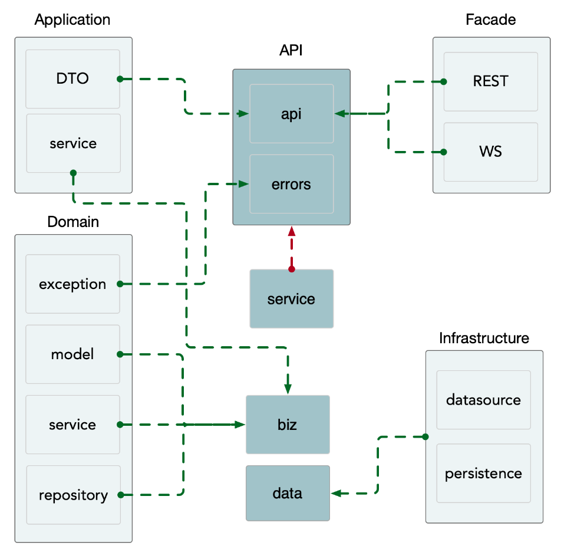

# kratos

- Reference 

  [Kratos (bilibili)](https://space.bilibili.com/1885628842), [Windfarer / kratos-realworld (github)](https://github.com/Windfarer/kratos-realworld), [beer-shop](https://github.com/go-kratos/beer-shop/), 

  [Kratos org](https://go-kratos.dev/), [Kratos (github)](https://github.com/go-kratos/kratos), [Kratos WX](https://mp.weixin.qq.com/s/Wm1pHZAbybHV6BLqDWEPVA), [Kratos engineering](https://mp.weixin.qq.com/mp/appmsgalbum?__biz=MzAwNzgwMzY2Ng==&action=getalbum&album_id=1816622127303753730&scene=126&sessionid=-1820420947&uin=&key=&devicetype=Windows+11+x64&version=63090a13&lang=zh_CN&ascene=0), 

  [gothinkster / realworld](https://github.com/gothinkster/realworld), [realworld docs](https://realworld-docs.netlify.app/docs/specs/backend-specs/introduction/), 
  
- Reference - dev

  [OpenAPI Swagger 使用](https://go-kratos.dev/docs/guide/openapi/), [Swagger UI](https://github.com/swagger-api/swagger-ui), 

  [Ent 数据库框架使用](https://go-kratos.dev/docs/guide/ent), [gorm docs](https://gorm.io/docs/), 

  [jwt](https://jwt.io/), [jwt-go (github)](https://github.com/golang-jwt/jwt), 
  
  


- Introduction

  基于Kratos框架实现社交化日志平台（类似medium.com）的案例完整开发流程，适合未接触过Kratos框架的同学。

  跟随本教程可以沉浸式体验到Kratos框架的正确使用姿势，了解框架的常用组件的用法，以及项目结构的设计思路
  
- Overview

  供前端 (浏览器) 使用的 web应用

  1. 框架的基本情况
  2. 初始化项目
  3. 定义API
  4. 填充业务逻辑
  5. 中间件使用 (登录时获取用户信息 鉴权)
  6. 自定义接口的返回格式

- 本教程不包含

  微服务相关的内容 (服务注册发现 ...)
  
  


## 项目创建与介绍

- 盘点名词

  contorl, service, mapper

  dto, vo, pojo, bo, dao, do

- 分层架构

  contorl: 

  service: 

  mapper: 

- 具体对象

  Data Transfer Object: 用于在不同层之间**传递数据**，它通常是可变的，并且不包含业务逻辑

  Value Object: 用于**传递数据**，但通常是不可变的，用于表示值而不是实体

  Plain Old Java Object: 普通的 Java 对象，可能被用于各种用途，包括表示实体、传递数据等

  Business Object: 业务实体，通常包含**业务逻辑和行为**

  Data Access Object: 封装数据访问逻辑，提供对数据源的抽象接口

  Domain Objects: 


### 初始化项目

- 环境准备

  [go](https://golang.org/dl/), (`GO111MODULE`, [`GOPROXY`](https://goproxy.cn/))

  [protoc](https://github.com/protocolbuffers/protobuf) (代码生成), [protoc-gen-go](https://github.com/protocolbuffers/protobuf-go) (插件)

  ```bash
  go version
  go env
  go env -w GOPATH=D:\devenv\go\
  go env -w GOPROXY=https://goproxy.cn,direct
  
  
  go install github.com/go-kratos/kratos/cmd/kratos/v2@latest
  kratos --version
  
  ```

- 脚手架 kratos  ([CLI工具](https://go-kratos.dev/docs/getting-started/usage))

  通过模板快速创建项目

  快速创建与生成 protoc 文件

  使用开发过程中常用的命令

  极大提高开发效率，减轻心智负担

  ```bash
  # 用脚手架拉取项目
  kratos new kratos-realworld
  kratos new kratos-realworld -r https://gitee.com/go-kratos/kratos-layout.git  # 可国内 可自定义
  # 也可以通过环境变量指定源
  KRATOS_LAYOUT_REPO=xxx-layout.git
  kratos new kratos-realworld
  
  
  cd kratos-realworld && code .
  make help
  make init 
  make api  # 现在不需要执行
  
  go mod tidy  
  go mod download
  
  
  cd kratos-realworld
  go generate ./...
  go build -o ./bin/ ./...
  ./bin/kratos-realworld -conf ./configs
  
  
  # 运行项目
  kratos run
  # http://localhost:8000/helloworld/eric
  
  ```

- 依赖注入 [wire](https://github.com/google/wire)

  ```bash
  go install github.com/google/wire/cmd/wire@latest
  
  ```
  
  项目结构  ([kratos docs](https://go-kratos.dev/docs/intro/layout), [kratos-layout](https://github.com/go-kratos/kratos-layout))
  
  ```
    .
  ├── Dockerfile  
  ├── LICENSE
  ├── Makefile  
  ├── README.md
  ├── api // 下面维护了微服务使用的proto文件以及根据它们所生成的go文件
  │   └── helloworld
  │       └── v1
  │           ├── error_reason.pb.go  # 编写.proto .go是生成的
  │           ├── error_reason.proto
  │           ├── error_reason.swagger.json
  │           ├── greeter.pb.go
  │           ├── greeter.proto
  │           ├── greeter.swagger.json
  │           ├── greeter_grpc.pb.go
  │           └── greeter_http.pb.go
  ├── cmd  // 整个项目启动的入口文件
  │   └── server
  │       ├── main.go
  │       ├── wire.go  // 我们使用wire来维护依赖注入
  │       └── wire_gen.go
  ├── configs  // 这里通常维护一些本地调试用的样例配置文件
  │   └── config.yaml
  ├── generate.go
  ├── go.mod
  ├── go.sum
  ├── internal  // 该服务所有不对外暴露的代码，通常的业务逻辑都在这下面，使用internal避免错误引用
  │   ├── biz   // 业务逻辑的组装层，类似 DDD 的 domain 层，data 类似 DDD 的 repo，而 repo 接口在这里定义，使用依赖倒置的原则。
  │   │   ├── README.md
  │   │   ├── biz.go
  │   │   └── greeter.go
  │   ├── conf  // 内部使用的config的结构定义，使用proto格式生成
  │   │   ├── conf.pb.go
  │   │   └── conf.proto
  │   ├── data  // 业务数据访问，包含 cache、db 等封装，实现了 biz 的 repo 接口。我们可能会把 data 与 dao 混淆在一起，data 偏重业务的含义，它所要做的是将领域对象重新拿出来，我们去掉了 DDD 的 infra层。
  │   │   ├── README.md
  │   │   ├── data.go
  │   │   └── greeter.go
  │   ├── server  // http和grpc实例的创建和配置
  │   │   ├── grpc.go
  │   │   ├── http.go
  │   │   └── server.go
  │   └── service  // 实现了 api 定义的服务层，类似 DDD 的 application 层，处理 DTO 到 biz 领域实体的转换(DTO -> DO)，同时协同各类 biz 交互，但是不应处理复杂逻辑
  │       ├── README.md
  │       ├── greeter.go
  │       └── service.go
  └── third_party  // api 依赖的第三方proto
      ├── README.md
      ├── google
      │   └── api
      │       ├── annotations.proto
      │       ├── http.proto
      │       └── httpbody.proto
      └── validate
          ├── README.md
          └── validate.proto
  ```
  
  
  
  


### 项目设计

- General functionality:

  Authenticate users via JWT (login/signup pages + logout button on settings page)

  CRU- users (sign up & settings page - no deleting required)

  CRUD Articles

  CR-D Comments on articles (no updating required)

  GET and display paginated lists of articles

  Favorite articles

  Follow other users

- 总结

  用户：登录(查询)、注册(增加)；查询当前用户、查询用户列表、更新用户信息；关注用户、取关用户

  文章：文章列表、文章首表；查询一篇、创建一篇、更新一篇、删除一篇

  评论：在某文章里加评论(增加)、拿某文章的评论(查询)、删除某文章的评论；点赞评论、取消点赞

  标签：标签列表

  

---

- Endpoints

  [Authentication Header:](https://realworld-docs.netlify.app/docs/specs/backend-specs/endpoints#authentication-header), [Authentication:](https://realworld-docs.netlify.app/docs/specs/backend-specs/endpoints#authentication), [Registration:](https://realworld-docs.netlify.app/docs/specs/backend-specs/endpoints#registration)

  [Get Current User](https://realworld-docs.netlify.app/docs/specs/backend-specs/endpoints#get-current-user), [Update User](https://realworld-docs.netlify.app/docs/specs/backend-specs/endpoints#update-user), [Get Profile](https://realworld-docs.netlify.app/docs/specs/backend-specs/endpoints#get-profile), [Follow user](https://realworld-docs.netlify.app/docs/specs/backend-specs/endpoints#follow-user), [Unfollow user](https://realworld-docs.netlify.app/docs/specs/backend-specs/endpoints#unfollow-user)

  [List Articles](https://realworld-docs.netlify.app/docs/specs/backend-specs/endpoints#list-articles), [Feed Articles](https://realworld-docs.netlify.app/docs/specs/backend-specs/endpoints#feed-articles), [Get Article](https://realworld-docs.netlify.app/docs/specs/backend-specs/endpoints#get-article), [Create Article](https://realworld-docs.netlify.app/docs/specs/backend-specs/endpoints#create-article), [Update Article](https://realworld-docs.netlify.app/docs/specs/backend-specs/endpoints#update-article), [Delete Article](https://realworld-docs.netlify.app/docs/specs/backend-specs/endpoints#delete-article)

  [Add Comments to an Article](https://realworld-docs.netlify.app/docs/specs/backend-specs/endpoints#add-comments-to-an-article), [Get Comments from an Article](https://realworld-docs.netlify.app/docs/specs/backend-specs/endpoints#get-comments-from-an-article), [Delete Comment](https://realworld-docs.netlify.app/docs/specs/backend-specs/endpoints#delete-comment)

  [Favorite Article](https://realworld-docs.netlify.app/docs/specs/backend-specs/endpoints#favorite-article), [Unfavorite Article](https://realworld-docs.netlify.app/docs/specs/backend-specs/endpoints#unfavorite-article), [Get Tags](https://realworld-docs.netlify.app/docs/specs/backend-specs/endpoints#get-tags)

- API Response format

  JSON Objects returned by API:

  [Users (for authentication)](https://realworld-docs.netlify.app/docs/specs/backend-specs/api-response-format#users-for-authentication), [Profile](https://realworld-docs.netlify.app/docs/specs/backend-specs/api-response-format#profile), [Single Article](https://realworld-docs.netlify.app/docs/specs/backend-specs/api-response-format#single-article), [Multiple Articles](https://realworld-docs.netlify.app/docs/specs/backend-specs/api-response-format#multiple-articles)

  [Single Comment](https://realworld-docs.netlify.app/docs/specs/backend-specs/api-response-format#single-comment), [Multiple Comments](https://realworld-docs.netlify.app/docs/specs/backend-specs/api-response-format#multiple-comments), [List of Tags](https://realworld-docs.netlify.app/docs/specs/backend-specs/api-response-format#list-of-tags)

- Error Handling

- CORS (跨域问题)

- Postman

  [Postman collection](https://github.com/gothinkster/realworld/blob/master/api/Conduit.postman_collection.json) 

- Tests


## API定义与生成

- 改名字

  `api/realworld/v1/` (realworld.proto, error_reason.proto)

  模板名称是 helloworld 需要替换 (体力活)

  代码生成器

  ```bash
  make api  # win 有问题
  protoc --proto_path=./api \
         --proto_path=./third_party \
         --go_out=paths=source_relative:./api \
         --go-http_out=paths=source_relative:./api \
         --go-grpc_out=paths=source_relative:./api \
         --openapi_out=fq_schema_naming=true,default_response=false:. \
         ./api/realworld/v1/realworld.proto ./api/realworld/v1/error_reason.proto 
         
  cd cmd/kratos-realworld/  # 到注解文件下 cmd\kratos-realworld\wire.go
  wire
  
  ```

  `internal\server` (...)

  `internal\service` (...)

  ```bash
  kratos run
  # http://localhost:8000/realworld/eric
  
  ```

  


- 写接口  (postman 代码生成 ...)

  [kratos api](https://go-kratos.dev/docs/component/api), [RealWorld User](https://realworld-docs.netlify.app/docs/specs/backend-specs/api-response-format#users-for-authentication), [json to protibuf](https://json-to-proto.github.io/); [protobuf synatx](https://protobuf.dev/programming-guides/proto3/)

  api\realworld\v1\realworld.proto (接口) -> `make api`

  internal\service\service.go (实现)  `kratos proto server api/realworld/v1/realworld.proto -t internal/service/`

  openapi.yaml [Swagger Editor](https://editor.swagger.io/)

  TODO 后续鉴权 ...


## 数据库接入与配置修改

- 操作 ent [gorm](https://gorm.io/docs/)

  ```bash
  # mysql
  mkdir -p deploy/docker && touch deploy/docker/docker-compose.yaml
  
  # https://github.com/go-kratos/beer-shop/blob/main/deploy/docker-compose/docker-compose.yaml
  version: "3"
  services:
    rwdb:
      image: mysql:8
      environment:
        MYSQL_ROOT_PASSWORD: 123456
  
  cd deploy/docker/ && docker-compose up -d
  docker ps
  docker exec -it docker-rwdb-1 bash
  mysql -uroot -p123456
  create database realworld;
  
  
  # gorm, mysql driver
  go get -u gorm.io/gorm
  go get -u gorm.io/driver/mysql
  
  # go install entgo.io/ent/cmd/ent@latest
  
  ```

- 编码

  internal\data\data.go

  ```go
  package data
  
  import (
  	"kratos-realworld/internal/conf"
  
  	"github.com/go-kratos/kratos/v2/log"
  	"github.com/google/wire"
  	"gorm.io/driver/mysql"
  	"gorm.io/gorm"
  )
  
  // ProviderSet is data providers.
  var ProviderSet = wire.NewSet(NewData, NewDB, NewGreeterRepo)
  
  // Data .
  type Data struct {
  	// TODO wrapped database client
  	db *gorm.DB
  }
  
  // NewData 
  func NewData(c *conf.Data, logger log.Logger, db *gorm.DB) (*Data, func(), error) {
  	cleanup := func() {
  		log.NewHelper(logger).Info("closing the data resources")
  	}
  	return &Data{db: db}, cleanup, nil
  }
  
  func NewDB(c *conf.Data) *gorm.DB {
  	db, err := gorm.Open(mysql.Open("root:123456@tcp(127.0.0.1:3307)/realworld?charset=utf8mb4&parseTime=True&loc=Local"), &gorm.Config{})
  	if err != nil {
  		panic("failed to connect database")
  	}
  
  	if err := db.AutoMigrate(); err != nil {
  		panic(err)
  	}
  	return db
  }
  
  ```

  internal\data\data_test.go

  ```go
  package data
  
  import "testing"
  
  func TestNewDB(t *testing.T) {
  	NewDB(nil)
  }
  
  ```

  依赖注入

  ```bash
  make wire
  
  ```

  


- 配置信息封装

  D:\code2\go-code\user-center-go\kratos-realworld\configs\config.yaml (配置信息)

  ```go
  data:
    database:
      dsn: root:123456@tcp(127.0.0.1:3307)/realworld?charset=utf8mb4&parseTime=True&loc=Local
  
  ```

  D:\code2\go-code\user-center-go\kratos-realworld\internal\conf\conf.proto (解析)

  ```go
  message Data {
    message Database {
      string driver = 1;
      string dsn = 2;
    }
    Database database = 1;
  }
  
  ```

  生成代码

  ```bash
  protoc --proto_path=./internal \
         --proto_path=./third_party \
         --go_out=paths=source_relative:./internal \
         internal/conf/conf.proto 
  
  ```

  


## 项目结构与依赖注入

- 依赖注入

  ```
  NewApp(Server)                          cmd/kratos-realworld/main.go       
  <- NewServer(Service)                   internal/server/server.go          var ProviderSet = wire.NewSet(NewGRPCServer, NewHTTPServer)
  <- NewService(UserUsecase)              internal/service/service.go        var ProviderSet = wire.NewSet(NewRealWorldService)
  <- NewUserUsecase(UserRepo:interface)   internal/biz/user.go               var ProviderSet = wire.NewSet(NewSocialUsecase, NewUserUsecase)
  <- NewUserRepo(Data)                    internal/data/user.go              
  <- NewData(DB)                          internal/data/data.go              var ProviderSet = wire.NewSet(NewData, NewDB, NewUserRepo, NewProfileRepo)
  <- NewDB(gorm)                          internal/data/data.go
  <- config                               configs/config.yaml(配置信息)  conf/conf.proto(定义结构)  conf/conf.pb.go(代码生成)
  
  复杂的链，需要依赖注入工具 wire (生成wire_gen.go)
  分层模块，独立测试和维护 
  ```
  
  cmd\kratos-realworld\wire_gen.go
  
  ```go
  // wireApp init kratos application.
  func wireApp(confServer *conf.Server, confData *conf.Data, logger log.Logger) (*kratos.App, func(), error) {
  	db := data.NewDB(confData)
  	dataData, cleanup, err := data.NewData(confData, logger, db)
  	if err != nil {
  		return nil, nil, err
  	}
  	userRepo := data.NewUserRepo(dataData, logger)
  	profileRepo := data.NewProfileRepo(dataData, logger)
  	userUsecase := biz.NewUserUsecase(userRepo, profileRepo, logger)
  	realWorldService := service.NewRealWorldService(userUsecase)
  	grpcServer := server.NewGRPCServer(confServer, realWorldService, logger)
  	httpServer := server.NewHTTPServer(confServer, realWorldService, logger)
  	app := newApp(logger, grpcServer, httpServer)
  	return app, func() {
  		cleanup()
  	}, nil
  }
  
  ```
  
  

---

- 规划

  social: anticle, comment - repo data

  user (usecase): login, register, profile

  ```bash
  touch internal/service/social.go
  
  ```

- service 层整理 (前次生成代码的分包)

  internal\service\service.go

  ```go
  package service
  
  import (
  	v1 "kratos-realworld/api/realworld/v1"
  	"kratos-realworld/internal/biz"
  
  	"github.com/google/wire"
  )
  
  // ProviderSet is service providers.
  var ProviderSet = wire.NewSet(NewRealWorldService)
  
  // GreeterService is a greeter service.
  type RealWorldService struct {
  	v1.UnimplementedRealWorldServer
  
  	uc *biz.UserUsecase
  }
  
  // NewGreeterService new a greeter service.
  func NewRealWorldService(uc *biz.UserUsecase) *RealWorldService {
  	return &RealWorldService{uc: uc}
  }
  
  ```

  internal\service\social.go

  ```go
  package service
  
  import (
  	"context"
  	v1 "kratos-realworld/api/realworld/v1"
  )
  
  // --------------------------------------------------------------------------------------------------
  func (s *RealWorldService) GetProfile(ctx context.Context, req *v1.GetProfileRequest) (*v1.ProfileReply, error) {
  	return &v1.ProfileReply{}, nil
  }
  
  func (s *RealWorldService) FollowUser(ctx context.Context, req *v1.FollowUserRequest) (*v1.ProfileReply, error) {
  	return &v1.ProfileReply{}, nil
  }
  
  func (s *RealWorldService) UnfollowUser(ctx context.Context, req *v1.UnfollowUserRequest) (*v1.ProfileReply, error) {
  	return &v1.ProfileReply{}, nil
  }
  
  // --------------------------------------------------------------------------------------------------
  func (s *RealWorldService) ListArticles(ctx context.Context, req *v1.ListArticlesRequest) (*v1.MultipleArticlesReply, error) {
  	return &v1.MultipleArticlesReply{}, nil
  }
  
  func (s *RealWorldService) FeedArticles(ctx context.Context, req *v1.FeedArticlesRequest) (*v1.MultipleArticlesReply, error) {
  	return &v1.MultipleArticlesReply{}, nil
  }
  
  func (s *RealWorldService) GetArticle(ctx context.Context, req *v1.GetArticleRequest) (*v1.SingleArticleReply, error) {
  	return &v1.SingleArticleReply{}, nil
  }
  
  func (s *RealWorldService) CreateArticle(ctx context.Context, req *v1.CreateArticleRequest) (*v1.SingleArticleReply, error) {
  	return &v1.SingleArticleReply{}, nil
  }
  
  func (s *RealWorldService) UpdateArticle(ctx context.Context, req *v1.UpdateArticleRequest) (*v1.SingleArticleReply, error) {
  	return &v1.SingleArticleReply{}, nil
  }
  
  func (s *RealWorldService) DeleteArticle(ctx context.Context, req *v1.DeleteArticleRequest) (*v1.EmptyReply, error) {
  	return &v1.EmptyReply{}, nil
  }
  
  // --------------------------------------------------------------------------------------------------
  func (s *RealWorldService) AddComment(ctx context.Context, req *v1.AddCommentRequest) (*v1.SingleCommentReply, error) {
  	return &v1.SingleCommentReply{}, nil
  }
  
  func (s *RealWorldService) GetComments(ctx context.Context, req *v1.GetCommentsRequest) (*v1.MultipleCommentsReply, error) {
  	return &v1.MultipleCommentsReply{}, nil
  }
  
  func (s *RealWorldService) DeleteComment(ctx context.Context, req *v1.DeleteCommentRequest) (*v1.EmptyReply, error) {
  	return &v1.EmptyReply{}, nil
  }
  
  func (s *RealWorldService) FavoriteArticle(ctx context.Context, req *v1.FavoriteArticleRequest) (*v1.SingleArticleReply, error) {
  	return &v1.SingleArticleReply{}, nil
  }
  
  func (s *RealWorldService) UnfavoriteArticle(ctx context.Context, req *v1.UnfavoriteArticleRequest) (*v1.SingleArticleReply, error) {
  	return &v1.SingleArticleReply{}, nil
  }
  
  // --------------------------------------------------------------------------------------------------
  func (s *RealWorldService) GetTags(ctx context.Context, req *v1.GetTagsRequest) (*v1.TagListReply, error) {
  	return &v1.TagListReply{}, nil
  }
  
  ```

  internal\service\user.go

  ```go
  package service
  
  import (
  	"context"
  	v1 "kratos-realworld/api/realworld/v1"
  )
  
  func (s *RealWorldService) Login(ctx context.Context, in *v1.LoginRequest) (*v1.UserReply, error) {
  	return &v1.UserReply{
  		User: &v1.UserReply_User{
  			Username: "admin",
  			Email:    "admin@admin.com",
  			Bio:      "I am a admin",
  			Image:    "https://example.com/avatar.png",
  			Token:    "eyJhbGciOiJIUzI1NiIsInR5cCI6IkpXVCJ9.eyJzdWIiOiIxMjM0NTY3ODssw5c",
  		},
  	}, nil
  }
  
  func (s *RealWorldService) Register(ctx context.Context, req *v1.RegisterRequest) (*v1.UserReply, error) {
  	return &v1.UserReply{
  		User: &v1.UserReply_User{
  			Username: "admin",
  		},
  	}, nil
  }
  
  func (s *RealWorldService) GetCurrentUser(ctx context.Context, req *v1.GetCurrentUserRequest) (*v1.UserReply, error) {
  	return &v1.UserReply{}, nil
  }
  
  func (s *RealWorldService) UpdateUser(ctx context.Context, req *v1.UpdateUserRequest) (*v1.UserReply, error) {
  	return &v1.UserReply{}, nil
  }
  
  ```

- biz 层创建 (大写 接口 定义方法)

  internal\biz\biz.go

  ```go
  package biz
  
  import "github.com/google/wire"
  
  // ProviderSet is biz providers.
  var ProviderSet = wire.NewSet(NewSocialUsecase, NewUserUsecase)
  
  ```

  internal\biz\social.go (internal\biz\greeter.go)

  ```go
  package biz
  
  import (
  	"context"
  
  	"github.com/go-kratos/kratos/v2/log"
  )
  
  // --------------------------------------------------------------------------------------------------
  type ArticleRepo interface {
  }
  
  type CommentRepo interface {
  }
  
  type TagRepo interface {
  }
  
  type SocialUsecase struct {
  	ar  ArticleRepo
  	cr  CommentRepo
  	tr  TagRepo
  	log *log.Helper
  }
  
  func NewSocialUsecase(ar ArticleRepo, cr CommentRepo, tr TagRepo, logger log.Logger) *SocialUsecase {
  	return &SocialUsecase{ar: ar, cr: cr, tr: tr, log: log.NewHelper(logger)}
  }
  
  // --------------------------------------------------------------------------------------------------
  func (uc *SocialUsecase) CreateArticle(ctx context.Context) error {
  	return nil
  }
  
  ```

  internal\biz\user.go

  ```go
  package biz
  
  import (
  	"context"
  
  	"github.com/go-kratos/kratos/v2/log"
  )
  
  type User struct {
  	Username string
  }
  
  // --------------------------------------------------------------------------------------------------
  type UserRepo interface {
  	CreateUser(ctx context.Context, user *User) error
  }
  
  type ProfileRepo interface {
  }
  
  type UserUsecase struct {
  	ur  UserRepo
  	pr  ProfileRepo
  	log *log.Helper
  }
  
  func NewUserUsecase(ur UserRepo, pr ProfileRepo, logger log.Logger) *UserUsecase {
  	return &UserUsecase{ur: ur, pr: pr, log: log.NewHelper(logger)}
  }
  
  // --------------------------------------------------------------------------------------------------
  func (uc *UserUsecase) Register(ctx context.Context, u *User) error {
  	err := uc.ur.CreateUser(ctx, u)
  	if err != nil {
  
  	}
  
  	return nil
  }
  
  ```

- data 层 (小写 实现接口)

  internal\data\data.go

  ```go
  package data
  
  import (
  	"kratos-realworld/internal/conf"
  
  	"github.com/go-kratos/kratos/v2/log"
  	"github.com/google/wire"
  	"gorm.io/driver/mysql"
  	"gorm.io/gorm"
  )
  
  // ProviderSet is data providers.
  var ProviderSet = wire.NewSet(NewData, NewDB, NewUserRepo, NewProfileRepo)
  
  // Data .
  type Data struct {
  	// TODO wrapped database client
  	db *gorm.DB
  }
  
  // NewData
  func NewData(c *conf.Data, logger log.Logger, db *gorm.DB) (*Data, func(), error) {
  	cleanup := func() {
  		log.NewHelper(logger).Info("closing the data resources")
  	}
  	return &Data{db: db}, cleanup, nil
  }
  
  func NewDB(c *conf.Data) *gorm.DB {
  	db, err := gorm.Open(mysql.Open(c.Database.Dsn), &gorm.Config{})
  	if err != nil {
  		panic("failed to connect database")
  	}
  
  	if err := db.AutoMigrate(); err != nil {
  		panic(err)
  	}
  	return db
  }
  
  ```

  internal\data\user.go

  ```go
  package data
  
  import (
  	"context"
  
  	"kratos-realworld/internal/biz"
  
  	"github.com/go-kratos/kratos/v2/log"
  )
  
  // --------------------------------------------------------------------------------------------------
  type userRepo struct {
  	data *Data
  	log  *log.Helper
  }
  
  type ProfileRepo struct {
  	data *Data
  	log  *log.Helper
  }
  
  func NewUserRepo(data *Data, logger log.Logger) biz.UserRepo {
  	return &userRepo{
  		data: data,
  		log:  log.NewHelper(logger),
  	}
  }
  
  func NewProfileRepo(data *Data, logger log.Logger) biz.ProfileRepo {
  	return &ProfileRepo{
  		data: data,
  		log:  log.NewHelper(logger),
  	}
  }
  
  // --------------------------------------------------------------------------------------------------
  func (r *userRepo) CreateUser(ctx context.Context, user *biz.User) error {
  	return nil
  }
  
  ```

- wire

  ```bash
  make wire
  
  ```

  


## biz层开发 和自定义中间件

### biz层开发 (未完成)

- 需求

  不能明文存储用户密码 [golang.org/x/crypto bcrypt](https://pkg.go.dev/golang.org/x/crypto)
  
  ```bash
  go get golang.org/x/crypto
  go get github.com/golang-jwt/jwt/v4
  go get github.com/davecgh/go-spew
  
  ```
  
- internal\biz\user.go

  ```go
  package biz
  
  import (
  	"context"
  	"errors"
  
  	"github.com/go-kratos/kratos/v2/log"
  	"golang.org/x/crypto/bcrypt"
  )
  
  type User struct {
  	Email        string
  	Username     string
  	Bio          string
  	Image        string
  	PasswordHash string // 数据库不能明文存储密码
  }
  
  type UserLogin struct {
  	Email    string
  	Username string
  	Token    string
  	Bio      string
  	Image    string
  }
  
  // --------------------------------------------------------------------------------------------------
  type UserRepo interface {
  	CreateUser(ctx context.Context, user *User) error
  	GetUserByEmail(ctx context.Context, email string) (*User, error)
  }
  
  type ProfileRepo interface {
  }
  
  type UserUsecase struct {
  	ur  UserRepo
  	pr  ProfileRepo
  	log *log.Helper
  }
  
  func NewUserUsecase(ur UserRepo, pr ProfileRepo, logger log.Logger) *UserUsecase {
  	return &UserUsecase{ur: ur, pr: pr, log: log.NewHelper(logger)}
  }
  
  // --------------------------------------------------------------------------------------------------
  func (uc *UserUsecase) Register(ctx context.Context, username, email, password string) (*UserLogin, error) {
  	// 1. 参数校验 TODO
  
  	// 2. 创建用户 (加密密码)
  	u := &User{
  		Email:        email,
  		Username:     username,
  		PasswordHash: hashPassword(password),
  	}
  	if err := uc.ur.CreateUser(ctx, u); err != nil {
  		return nil, err
  	}
  
  	// 3. 返回用户信息
  	return &UserLogin{
  		Email:    email,
  		Username: username,
  		Token:    "xxx",
  		Bio:      "xx",
  		Image:    "x",
  	}, nil
  }
  
  func (uc *UserUsecase) Login(ctx context.Context, email, password string) (*UserLogin, error) {
  	// 1. 查询用户
  	u, err := uc.ur.GetUserByEmail(ctx, email)
  	if err != nil {
  		return nil, err
  	}
  
  	// 2. 验证密码
  	verifyPassword(u.PasswordHash, password)
  	if !verifyPassword(u.PasswordHash, password) {
  		return nil, errors.New("login failed")
  	}
  
  	// 3. 返回用户信息
  	return &UserLogin{
  		Email:    u.Email,
  		Username: u.Username,
  		Token:    "xxx",
  		Bio:      u.Bio,
  		Image:    u.Image,
  	}, nil
  }
  
  // --------------------------------------------------------------------------------------------------
  func hashPassword(pwd string) string {
  	b, err := bcrypt.GenerateFromPassword([]byte(pwd), bcrypt.DefaultCost)
  	if err != nil {
  		panic(err)
  	}
  	return string(b)
  }
  
  func verifyPassword(hashedPwd, inputPwd string) bool {
  	if err := bcrypt.CompareHashAndPassword([]byte(hashedPwd), []byte(inputPwd)); err != nil {
  		return false
  	}
  	return true
  }
  
  ```

  internal\biz\user_test.go

  ```go
  package biz
  
  import (
  	"testing"
  
  	"github.com/stretchr/testify/assert"
  )
  
  func TestHashPasswork(t *testing.T) {
  	s := hashPassword("123456")
  	t.Log(s)                        // 输出加密后的密码
  	assert.NotEqual(t, s, "123456") // 加密后的密码不等于原始密码
  }
  
  func TestVerifyPassword(t *testing.T) {
  	hashPwd := "$2a$10$C.EFL6UY9NewoPSUd6bCeuJs0/ihHdGfgIb0q5hceB35CUm68Iu3C"
  	assert.True(t, verifyPassword(hashPwd, "123456"))
  	assert.False(t, verifyPassword(hashPwd, "1234567"))
  }
  
  ```

  internal\data\user.go

  ```go
  
  ```

  

---

### 自定义中间件

- Middleware  [Kratos docs](https://go-kratos.dev/docs/component/middleware/overview) 

  Kratos service Middleware (http, gprc)

  http Filter mux

  gprc unaryinterceptor

- 实现步骤

  internal\server\http.go (需要注册服务)  

  中间件的分流：有些地方要jwt 有些地方不用

  参考demo：[NewWhiteListMatcher()](https://github.com/go-kratos/beer-shop/blob/b12402ebc618c4563e69757e65a6db4dd767a869/app/shop/interface/internal/server/http.go#L21)

  ```go
  func NewHTTPServer(c *conf.Server, jwtc *conf.JWT, greeter *service.RealWorldService, logger log.Logger) *http.Server {
  	var opts = []http.ServerOption{
  		http.Middleware(
  			recovery.Recovery(),
  			// auth.JWTAuthMiddleware(jwtc.Token),  // 需要分流
  			selector.Server(auth.JWTAuthMiddleware(jwtc.Token)).Match(NewskipRoutersMatcher()).Build(),
  		),
  	}
  	
  
  // --------------------------------------------------------------------------------------------------
  func NewskipRoutersMatcher() selector.MatchFunc {
  
  	skipRouters := make(map[string]struct{})
  	skipRouters["/realworld.v1.RealWorld/Login"] = struct{}{}
  	skipRouters["/realworld.v1.RealWorld/Register"] = struct{}{}
  	return func(ctx context.Context, operation string) bool {
  		if _, ok := skipRouters[operation]; ok {
  			return false
  		}
  		return true
  	}
  }
  ```

  internal\pkg\middleware\auth\auth.go (中间件编写)  

  [Simple example of parsing and validating a token](https://pkg.go.dev/github.com/golang-jwt/jwt/v5#example-Parse-Hmac)

  [Simple example of building and signing a token](https://pkg.go.dev/github.com/golang-jwt/jwt/v5#example-New-Hmac)

  ```go
  package auth
  
  import (
  	"context"
  	"errors"
  	"fmt"
  	"time"
  
  	"github.com/davecgh/go-spew/spew"
  	"github.com/go-kratos/kratos/v2/middleware"
  	"github.com/go-kratos/kratos/v2/transport"
  	"github.com/golang-jwt/jwt/v4"
  )
  
  func JTWAuthMiddleware() middleware.Middleware {
  	return func(handler middleware.Handler) middleware.Handler {
  		return func(ctx context.Context, req interface{}) (reply interface{}, err error) {
  			if tr, ok := transport.FromServerContext(ctx); ok {
  				tokenString := tr.RequestHeader().Get("Authorization")
  				// spew.Dump(tokenString)
  
  				token, err := jwt.Parse(tokenString, func(token *jwt.Token) (interface{}, error) {
  					// Don't forget to validate the alg is what you expect:
  					if _, ok := token.Method.(*jwt.SigningMethodHMAC); !ok {
  						return nil, fmt.Errorf("Unexpected signing method: %v", token.Header["alg"])
  					}
  					// hmacSampleSecret is a []byte containing your secret, e.g. []byte("my_secret_key")
  					return "secret", nil
  				})
  				if err != nil {
  					return nil, err
  				}
  
  				if claims, ok := token.Claims.(jwt.MapClaims); ok {
  					fmt.Println(claims["foo"], claims["nbf"])
  					spew.Dump(claims["userId"])
  				} else {
  					return nil, errors.New("invalid token")
  				}
  
  			}
  			return handler(ctx, req)
  		}
  	}
  }
  
  // --------------------------------------------------------------------------------------------------
  func GenerateToken() (string, error) {
  	token := jwt.NewWithClaims(jwt.SigningMethodHS256, jwt.MapClaims{
  		"userId": 1122,
  		"nbf":    time.Date(2015, 10, 10, 12, 0, 0, 0, time.UTC).Unix(),
  	})
  
  	// Sign and get the complete encoded token as a string using the secret
  	tokenString, err := token.SignedString("secret")
  	if err != nil {
  		panic(err)
  	}
  	return tokenString, nil
  }
  
  ```

- configs\config.yaml (配置信息)

  ```yaml
  jwt:
    secret: "hello"
  ```

  internal\conf\conf.proto 

  ```protobuf
  message Bootstrap {
    Server server = 1;
    Data data = 2;
    Jtw jwt = 3;
  }
  
  
  message JWT {
    string token = 1;
  }
  
  ```

  生成代码

  ```
  # make config
  protoc --proto_path=./internal \
         --proto_path=./third_party \
         --go_out=paths=source_relative:./internal \
         ./internal/conf/conf.proto
  
  ```

- cmd\kratos-realworld\main.go

  ```go
  	app, cleanup, err := wireApp(bc.Server, bc.Data, bc.Jwt, logger)
  ```

  cmd\kratos-realworld\wire.go

  ```go
  func wireApp(*conf.Server, *conf.Data, *conf.Jtw, log.Logger) (*kratos.App, func(), error) {
  ```

  生成代码

  ```
  make wire
  
  ```

  internal\server\http.go

  ```go
  func NewHTTPServer(c *conf.Server, jwtc *conf.Jtw, greeter *service.RealWorldService, logger log.Logger) *http.Server {
  	var opts = []http.ServerOption{
  		http.Middleware(
  			recovery.Recovery(),
  			auth.JTWAuthMiddleware(jwtc.Token),
  		),
  	}
  ```

  ...

- 写进去 

  `JTWAuthMiddleware(secret string)`
  
  

---

- 分层架构

  internal\service\user.go (服务调用层)

  ```go
  package service
  
  import (
  	"context"
  	v1 "kratos-realworld/api/realworld/v1"
  )
  
  func (s *RealWorldService) Login(ctx context.Context, in *v1.LoginRequest) (*v1.UserReply, error) {
  	u, err := s.uc.Login(ctx, in.User.Email, in.User.Password)
  	if err != nil {
  		return nil, err
  	}
  
  	return &v1.UserReply{
  		User: &v1.UserReply_User{
  			Username: u.Username,
  			Email:    u.Email,
  			Bio:      u.Bio,
  			Image:    u.Image,
  			Token:    u.Token,
  		},
  	}, nil
  }
  
  func (s *RealWorldService) Register(ctx context.Context, req *v1.RegisterRequest) (*v1.UserReply, error) {
  	u, err := s.uc.Register(ctx, req.User.Username, req.User.Email, req.User.Password)
  	if err != nil {
  		return nil, err
  	}
  
  	return &v1.UserReply{
  		User: &v1.UserReply_User{
  			Username: u.Username,
  			Email:    u.Email,
  			Bio:      u.Bio,
  			Image:    u.Image,
  			Token:    u.Token,
  		},
  	}, nil
  }
  
  func (s *RealWorldService) GetCurrentUser(ctx context.Context, req *v1.GetCurrentUserRequest) (*v1.UserReply, error) {
  	return &v1.UserReply{}, nil
  }
  
  func (s *RealWorldService) UpdateUser(ctx context.Context, req *v1.UpdateUserRequest) (*v1.UserReply, error) {
  	return &v1.UserReply{}, nil
  }
  
  ```

  internal\biz\user.go (业务逻辑层)

  ```go
  package biz
  
  import (
  	"context"
  	"errors"
  	"kratos-realworld/internal/conf"
  	"kratos-realworld/internal/pkg/middleware/auth"
  
  	"github.com/go-kratos/kratos/v2/log"
  	"golang.org/x/crypto/bcrypt"
  )
  
  type User struct {
  	Email        string
  	Username     string
  	Bio          string
  	Image        string
  	PasswordHash string // 数据库不能明文存储密码
  }
  
  type UserLogin struct {
  	Email    string
  	Username string
  	Token    string
  	Bio      string
  	Image    string
  }
  
  // --------------------------------------------------------------------------------------------------
  type UserRepo interface {
  	CreateUser(ctx context.Context, user *User) error
  	GetUserByEmail(ctx context.Context, email string) (*User, error)
  }
  
  type ProfileRepo interface {
  }
  
  type UserUsecase struct {
  	ur   UserRepo
  	pr   ProfileRepo
  	jwtc *conf.JWT
  	log  *log.Helper
  }
  
  func NewUserUsecase(ur UserRepo, pr ProfileRepo, jwtc *conf.JWT, logger log.Logger) *UserUsecase {
  	return &UserUsecase{ur: ur, pr: pr, jwtc: jwtc, log: log.NewHelper(logger)}
  }
  
  // --------------------------------------------------------------------------------------------------
  func (uc *UserUsecase) Register(ctx context.Context, username, email, password string) (*UserLogin, error) {
  	// 1. 参数校验 TODO
  	if len(username) < 3 || len(username) > 20 {
  		return nil, errors.New("username length must be between 3 and 20")
  	}
  	if len(email) < 3 || len(email) > 20 {
  		return nil, errors.New("email length must be between 3 and 20")
  	}
  	if len(password) < 4 || len(password) > 20 {
  		return nil, errors.New("password length must be between 4 and 20")
  	}
  
  	// 用户是否存在
  	if _, err := uc.ur.GetUserByEmail(ctx, email); err == nil {
  		return nil, errors.New("email already exists")
  	}
  
  	// 2. 创建用户 (加密密码)
  	u := &User{
  		Email:        email,
  		Username:     username,
  		PasswordHash: hashPassword(password),
  	}
  	if err := uc.ur.CreateUser(ctx, u); err != nil {
  		return nil, err
  	}
  
  	// 3. 返回用户信息
  	return &UserLogin{
  		Email:    email,
  		Username: username,
  		Token:    uc.generateToken(username),
  		Bio:      "Please update your bio",
  		Image:    "default-avatar.png",
  	}, nil
  }
  
  func (uc *UserUsecase) Login(ctx context.Context, email, password string) (*UserLogin, error) {
  	// 1. 查询用户
  	u, err := uc.ur.GetUserByEmail(ctx, email)
  	if err != nil {
  		return nil, err
  	}
  
  	// 2. 验证密码
  	verifyPassword(u.PasswordHash, password)
  	if !verifyPassword(u.PasswordHash, password) {
  		return nil, errors.New("login failed")
  	}
  
  	// 3. 返回用户信息
  	return &UserLogin{
  		Email:    u.Email,
  		Username: u.Username,
  		Token:    uc.generateToken(u.Username),
  		Bio:      u.Bio,
  		Image:    u.Image,
  	}, nil
  }
  
  // --------------------------------------------------------------------------------------------------
  func hashPassword(pwd string) string {
  	b, err := bcrypt.GenerateFromPassword([]byte(pwd), bcrypt.DefaultCost)
  	if err != nil {
  		panic(err)
  	}
  	return string(b)
  }
  
  func verifyPassword(hashedPwd, inputPwd string) bool {
  	if err := bcrypt.CompareHashAndPassword([]byte(hashedPwd), []byte(inputPwd)); err != nil {
  		return false
  	}
  	return true
  }
  
  func (uc *UserUsecase) generateToken(username string) string {
  	return auth.GenerateToken(uc.jwtc.Token, username)
  }
  
  ```

  internal\data\user.go (数据库操作层)

  ```go
  
  ```

  


## CORS和HTTP中间件自定义


## HTTP错误返回结构


## data层开发


## 错误处理


## 构建和部署


# Kratos WX


## 漫游指南


## 工程化

### 依赖注入

- wire 背景

  微服务框架 [**kratos v2**](https://github.com/go-kratos/kratos) 的默认项目模板中 [**kratos-layout**](https://github.com/go-kratos/kratos-layout) 中使用了 [**google/wire**](https://github.com/google/wire) 进行依赖注入

  也建议开发者在维护项目时使用该工具

- What

  由 google 开源的一个供 Go 语言使用的依赖注入代码生成工具。它能够根据你的代码，生成相应的依赖注入 go 代码

  wire 能在编译期（代码生成时）如果依赖注入有问题，在代码生成时即可报出来，不会拖到运行时才报，更便于 debug

- Why

  **依赖注入** (Dependency Injection)，一种代码的构造模式（就是写法），代码更加容易维护

  如何发展出来的推导过程???

  


#### 为什么要依赖注入

- 依赖注入

  **依赖**是什么？此依赖是个名词，不是指软件包的依赖（node_modules），而是指软件中某一个模块（对象/实例）所依赖的其它外部模块（对象/实例）

  **注入**到哪里？被依赖的模块，在创建模块时，被注入到（即当作参数传入）模块的里面


- web开发场景

  任务：接一个 mysql，从里面把数据按照 id 查出来

  提供：`NewMySQLClient`的方法返回 client，初始化时传个地址进去就能拿到数据库连接，并有个`Exec`的方法给执行参数

  ```go
  # 伪代码 忽略了很多与主题无关的细节
  
  type App struct {
      
  }
  
  # 假设这个方法将会匹配并处理 GET /biu/<id> 这样的请求
  func (a *App) GetData(id string) string {
      # todo: write your data query
      return "some data"
  }
  
  func NewApp() *App {
      return &App{}
  }
  
  func main() {
      app := App()
      app.Run()
  }
  
  ```

- **没有 DI，通过全局变量传递依赖实例**

  app 依赖了全局变量 db (严重不推荐)

  db 这个对象游离在全局作用域，暴露给包下的其他模块，**比较危险** (设想如果这个包里其他代码在运行时悄悄把你的这个 db 变量替换掉会发生啥)

  ```go
  var mysqlUrl = "mysql://blabla"
  var db = NewMySQLClient(mysqlUrl)
  
  
  type App struct {
  
  }
  
  func (a *App) GetData(id string) string {
      data := db.Exec("select data from biu where id = ? limit 1", id)
      return data
  }
  
  func NewApp() *App {
      return &App{}
  }
  
  func main() {
      app := App()
      app.Run()
  }
  
  ```

- **不用 DI，在 App 的初始化方法里创建依赖实例**

  db 被塞到 app 里面了，不会有 app 之外的无关代码碰它，比较安全

  这不是依赖注入，而是在内部创建了依赖 (**高耦合**)

  ```go
  type App struct {
      db *MySQLClient
  }
  
  func (a *App) GetData(id string) string {
      data := a.db.Exec("select data from biu where id = ? limit 1", id)
      return data
  }
  
  func NewApp() *App {
      return &App{db: NewMySQLClient(mysqlUrl)}
  }
  
  func main() {
      app := NewApp("mysql://blabla")
      app.Run()
  }
  ```

  

---

- 新任务：数据改从 Redis 里读 (Postgres ...)

  1. App 初始化方法里改成了初始化 RedisClient
  2. get_data 里取数据时改用 run 方法，并且查询语句也换了
  3. App 实例化时传入的参数改成了 redis 地址

  ```go
  type App struct {
      ds *RedisClient
  }
  
  func (a *App) GetData(id string) string {
      data := a.ds.Do("GET", "biu_"+id)
      return data
  }
  
  
  func NewApp() *App {
      return &App{ds: NewRedisClient(redisAddr)}
  }
  
  func main() {
      app := NewApp("redis://ooo")
      app.Run()
  }
  
  ```

- **面向接口interface编程** (不是面向具体实现编程)

  预料到数据源的实现，很有可能被更换，因此在一开始就应该做好设计

  > 设计接口 (duck-typing)
  >
  > 不论是 Mysql 实现还是 Redis 实现，他们都有个共同的功能：用一个 id，查一个数据出来，那么这就是共同的接口
  >
  > 约定一个叫 DataSource 的接口，它必须有一个方法叫 GetById，功能是要接收一个 id，返回一个字符串
  >
  > 在 App 里处理请求的部分就可以稳定地调用 GetById 这个方法，而底层数据实现只要实现了 DataSource 这个 interface 就能花式替换，不用改 App 内部的代码了

  由于两种数据源都实现了 DataSource 接口，因此可以直接创建一个塞到 App 里面了，想用哪个用哪个

  ```go
  // 设计接口：GetById(id) -> string
  type DataSource interface {
      GetById(id string) string
  }
  
  
  // 封装个redis
  type redis struct {
      r *RedisClient
  }
  
  func NewRedis(addr string) *redis {
      return &redis{db: NewRedisClient(addr)}
  }
  
  func (r *redis) GetById(id string) string {
      return r.r.Do("GET", "biu_"+id)
  }
  
  
  // 再封装个mysql
  type mysql struct {
      m *MySQLClient
  }
  
  func NewMySQL(addr string) *redis {
      return &mysql{db: NewMySQLClient(addr)}
  }
  
  func (m *mysql) GetById(id string) string {
      return r.m.Exec("select data from biu where id = ? limit 1", id)
  }
  
  
  type App struct {
      ds DataSource
  }
  
  func NewApp(addr string) *App {
      //需要用Mysql的时候
      return &App{ds: NewMySQLClient(addr)}
  
      //需要用Redis的时候
      return &App{ds: NewRedisClient(addr)}
  }
  
  
  ```

  

---

- 中间件的连接有一堆参数

  配在一个 yaml 文件里，需要解析到一个 struct 里面，然后再传给对应的 New 方法

  yaml 

  ```yaml
  redis:
      addr: 127.0.0.1:6379
      read_timeout: 0.2s
      write_timeout: 0.2s
  ```

  struct 

  ```go
  type RedisConfig struct {
   Network      string             `json:"network,omitempty"`
   Addr         string             `json:"addr,omitempty"`
   ReadTimeout  *duration.Duration `json:"read_timeout,omitempty"`
   WriteTimeout *duration.Duration `json:"write_timeout,omitempty"`
  }
  ```

  NewApp

  ```go
  func NewApp() *App {
      var conf *RedisConfig
      yamlFile, err := ioutil.ReadFile("redis_conf.yaml")
      if err != nil {
          panic(err)
      }
      err = yaml.Unmarshal(yamlFile, &conf)
      if err != nil {
          panic(err)
      }
      return &App{ds: NewRedisClient(conf)}
  }
  ```

- 模块分工 (不断往上抽)

  依赖注入：在创建模块时，被注入到（即当作参数传入）初始化函数里面

  `NewRedis(conf) -> DataSource` 不需要关心文件是怎么读的

  `NewApp(DataSource) -> App` 不想关心你这配置文件是通过网络请求拿来的还是从本地磁盘读的 

  可以通过实现 DataSource 接口，更换读取配置文件的方法，和更换创建 DataSource 的方法，来任意修改底层实现（读配置文件的实现，和用哪种 DataSource 来查数据）

  ```go
  func GetRedisConf() *RedisConfig
  func NewRedis(conf *RedisConfig) DataSource
  
  func NewApp(ds DataSource) *App {
      return &App{ds: ds}
  }
  
  func initApp() *App {
      c := GetRedisConf()
      r := NewRedis(c)
      app := NewApp(r)
      return app
  }
  
  func main() {
      app := initApp()
      app.Run()
  }
  ```

  


#### 如何实现依赖注入

- 注入依赖的过程

  把各个实例初始化好，再按照各个初始化方法的需求塞进去，最终构造出 app 

- 手工依赖注入 (麻烦)

  一旦你要维护的东西多了 ...

  `UserService(pg *Postgres, mm *Memcached)`

  `NewApp(r *Redis, es *ES, us *UserSerivce, db *MySQL) *App`

- wire 

  他的功能只是通过生成代码**帮你注入依赖**

  而实际的依赖实例需要你自己创建（初始化）

  

---

- 如何用 wire 实现依赖注入

  wire.go 

  > 定义好 Injector (`initApp`) 
  >
  > 然后分别实现好 Provider

  ```go
  // +build wireinject
  
  func initApp() (*App) {
   panic(wire.Build(GetRedisConf, NewRedis, SomeProviderSet, NewApp))
  }
  ```

  执行命令 wire

  扫描整个项目，并帮你生成一个`wire_gen.go`文件，如果有什么没有实现好，会报错出来


## 微服务框架


